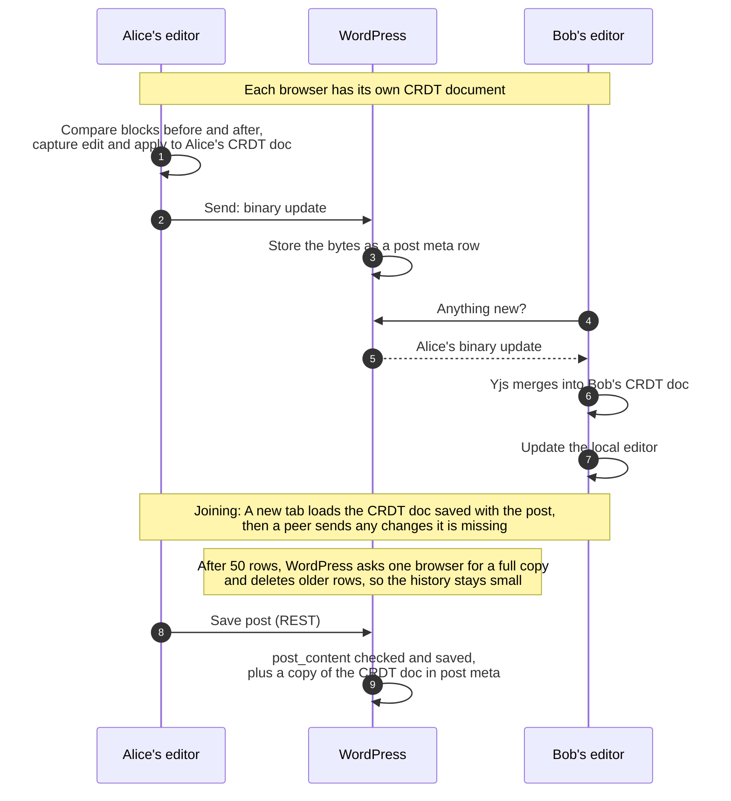
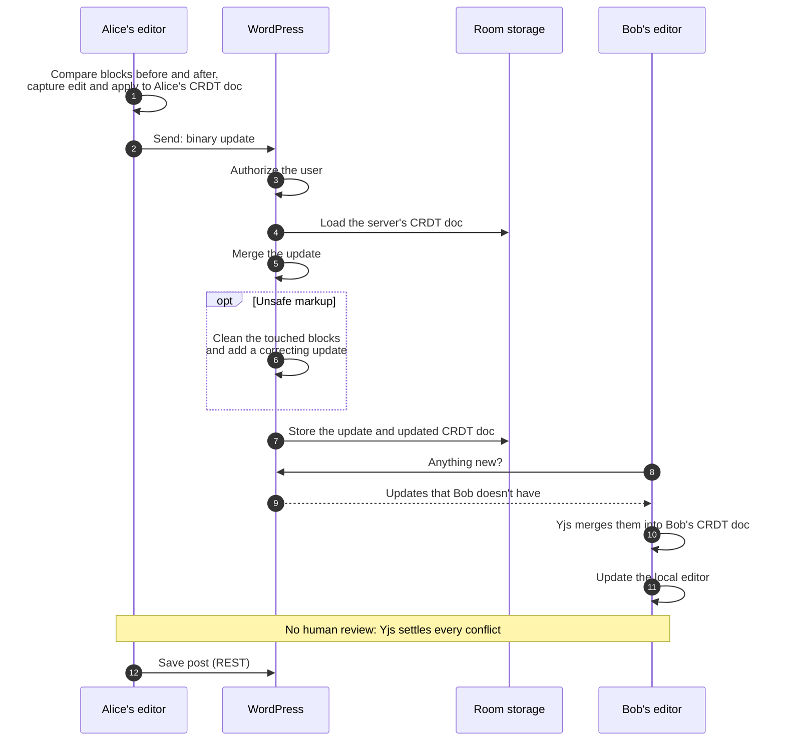
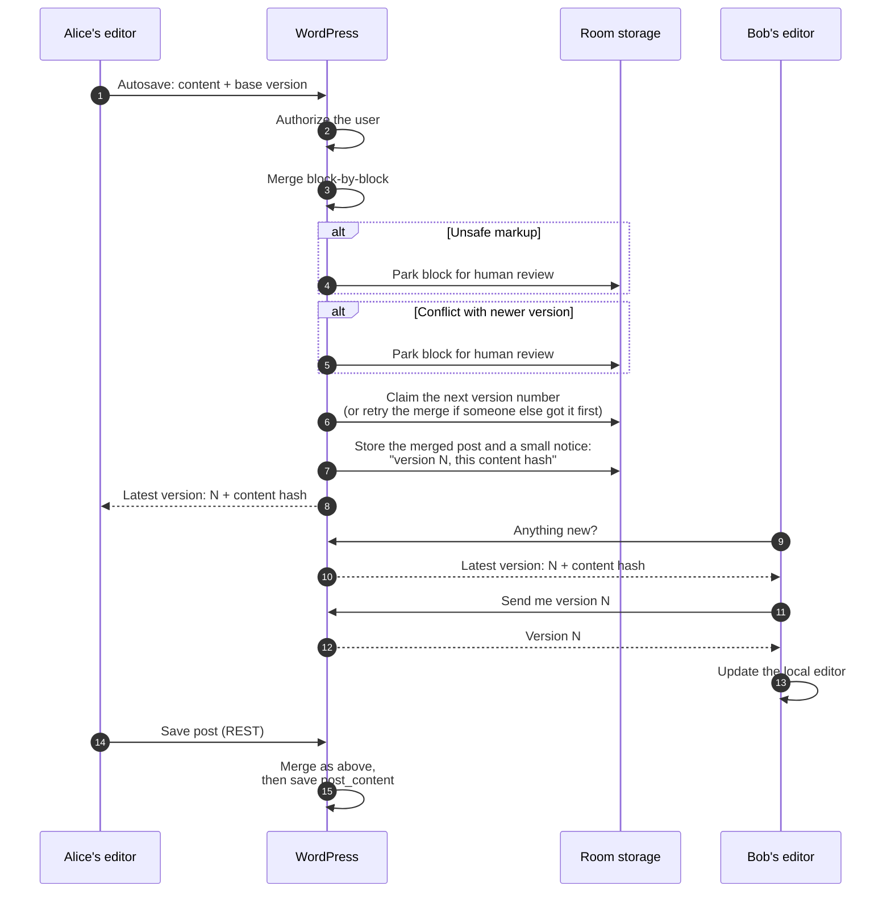

# Data flow

This page shows how one person's update reaches everyone else during
collaborative editing. It covers today's Gutenberg experiment
(including the WPVIP WebSocket transport, which can stand in for its
polling) and what this plugin proposes.

## Short version

Currently, RTC is available in Gutenberg via an experiment. We'll compare
how things work in the Gutenberg experiment and in this plugin.

In the Gutenberg experiment, **browsers merge updates and WordPress
is just a relay**. WordPress stores the updates as bytes, but cannot
read them, validate them, sanitize them, or notice that two people
changed the same thing. It is only aware of how the content has changed
when someone saves the post.

This plugin proposes that **WordPress takes part in every update**. The
server receives each edit, checks who sent it and what it contains,
merges it, and stores the result. Other browsers then receive what the
server accepted. All three engines work this way, and they differ only
in how the merge works. The engine choice and the transport choice are
separate: any engine runs over any transport.

|                                             | Gutenberg experiment                | This plugin                                                                |
| ------------------------------------------- | ----------------------------------- | -------------------------------------------------------------------------- |
| Who merges                                  | Browsers                            | WordPress (yjs-server: also browsers)                                      |
| What WordPress can read                     | Nothing until the post is saved     | Every edit as it arrives                                                   |
| Markup safety checks (`kses`) on live edits | None                                | Every edit as it arrives                                                   |
| Same-spot conflicts                         | Settled silently                    | Set aside for review (intent-log, de-rtc) or settled silently (yjs-server) |
| How edits travel                            | Short polling, or WPVIP's WebSocket | Short polling, server-sent events (web tier or daemon), or WebSocket       |
| Where edits are stored                      | Post meta on a custom post type     | Two custom tables                                                          |

A **room** is one shared document, usually a post. A **row** is one
stored entry in a room's history. Every browser remembers the last row
it has seen, and asks for the rows after it.

## Block editor data flow

### Gutenberg experiment

Each browser keeps its own copy of the post as a CRDT (Yjs) document.
Browsers send Yjs updates (binary data) to WordPress. WordPress stores
them and relays them to the other browsers, which merge them into their
copy.

If you'd like a more detailed breakdown of the data flow, see the
[fine-grained data flow](#fine-grained-data-flow) section below.

What this means:

-   The server is a relay. It cannot reject unsafe markup, enforce
    per-block rules, or tell a real conflict from a clean merge.
-   Content is checked only when someone saves the post. Until then, a
    user who can edit the post can push any block content into the other
    editors.
-   Two people changing the same thing at once do not see a conflict. Yjs
    merges the changes silently. For single values, one edit wins (chosen
    by client ID, not by time). For text, both people's typing is kept.

**The WPVIP WebSocket transport** works the same way. It replaces only
the WordPress polling provider, through Gutenberg's `sync.providers`
filter. Each browser asks WordPress for a short-lived signed token,
which WordPress issues only if the user can edit the post. The browser
then opens a WebSocket to a separate Node.js server. That server checks
the token and relays Yjs updates and presence between browsers. It
keeps rooms in memory only and stores nothing, so WordPress still sees
the content only when the post is saved, along with the copy of the
CRDT doc saved with it.

### This plugin, intent-log engine

The browser turns each change into a small, readable description, such
as "insert 'x' at position 4 in paragraph 2". Each description records
which point in the history it was made against (base sequence).
WordPress puts edits in order one room at a time. If there are newer
updates, it attempts to adjust the update so that it can be cleanly
merged. If it cannot adjust an edit safely, it sets it aside for a human
to review.

```mermaid
sequenceDiagram
    autonumber
    participant A as Alice's editor
    participant WP as WordPress
    participant DB as Room storage
    participant B as Bob's editor
    A->>A: Compare blocks before and after,<br/>describe the change
    A->>WP: Send: Edit + base sequence
    WP->>WP: Authorize the user
    WP->>WP: Lock the room
    alt Unsafe markup
        WP->>DB: Park edit for human review
    else Conflicts with newer edit
        WP->>DB: Park edit for human review
    else Clean
        WP->>WP: Adjust it for newer edits
        WP->>DB: Store the adjusted edit
    end
    WP-->>A: Adjusted edit
    B->>WP: Anything new?
    WP-->>B: Adjusted and parked edits
    B->>B: Update the local editor
    Note over A,B: Both editors show parked edits in special review UI
    A->>WP: Save post (REST)
```

### This plugin, yjs-server engine

The browser side is the same as the Gutenberg experiment: each browser
maintains a CRDT document and sends binary Yjs updates. The difference
is that WordPress has a full Yjs library, holds its own canonical CRDT
document, and merges every update into it. Because the server can read
the merged result, it can check content.

### This plugin, de-rtc engine

A save-based merging engine where the browser sends the whole post, plus
its base version, through the ordinary autosave endpoint. WordPress
compares three versions: the base version, the newest version (if it
exists), and the proposed version. It merges them block by block and
announces the new version number. Other browsers then fetch and apply
the new version.

### Engine comparison

|                                                     | Gutenberg experiment      | intent-log             | yjs-server                            | de-rtc                          |
| --------------------------------------------------- | ------------------------- | ---------------------- | ------------------------------------- | ------------------------------- |
| What a browser sends                                | Yjs updates               | Small typed edits      | Yjs updates                           | The whole post, on timer        |
| Who merges                                          | Browsers                  | WordPress              | WordPress and browsers                | WordPress                       |
| Two people change the same spot                     | Merged silently           | Set aside for review   | Merged silently                       | Set aside for review            |
| Unsafe markup from a user without `unfiltered_html` | Reaches peers, vulnerable | Set aside for approval | Cleaned by the server                 | Set aside for approval          |
| Server cost per edit                                | Store and forward         | Lock, adjust, store    | Decode, merge, and re-encode CRDT doc | Merge the whole post            |
| Who writes `post_content`                           | The editor's save         | The editor's save      | The editor's save                     | The editor's save, merged first |
| New room starts from                                | Saved entity              | Saved entity           | Saved entity                          | Saved entity                    |

## Transports

A transport is how updates travel between the server and peers. This
plugin provides multiple transport options. Any engine runs over any
transport.

Short polling also opens an **advisory channel** in each editor tab: a
side channel that carries only presence ("who is here") and "something
changed, go and poll" notices. It never carries content, which always
comes from WordPress. When every tab in a room can reach every other
tab, tabs poll only when told that something changed, so an idle room
makes almost no requests and a change arrives in under a second. A tab
that cannot reach a peer falls back to polling on a timer.

The channel runs over one of two links, chosen on the settings screen:
a direct browser-to-browser WebRTC connection, set up through the
WordPress Heartbeat (the default), or a WebSocket to the plugin's sync
server or to a relay the host runs. Only users who can edit the post
join a room's channel, and the worst a misbehaving peer can do is cause
extra polls or show false presence.

|                     | Gutenberg experiment short polling           | Short-polling                                | SSE                           | SSE from the daemon                     | WebSocket                                  |
| ------------------- | -------------------------------------------- | -------------------------------------------- | ----------------------------- | --------------------------------------- | ------------------------------------------ |
| Advisory channel    | No                                           | WebRTC or WebSocket                          | Off while the stream is open  | Off while the stream is open            | Not used                                   |
| New services to run | None                                         | None                                         | None, Redis optional          | Separate PHP daemon (the WebSocket one) | Separate PHP daemon                        |
| Credentials         | Cookie + nonce                               | Cookie + nonce                               | Cookie + nonce                | One-time token + cookie                 | One-time token + cookie, or a signed token |
| Long-lived process  | No                                           | No                                           | One PHP worker per connection | One long-running process                | One long-running process                   |
| Typical latency     | 1 s                                          | <1 s with advisory channel, else 5 s         | <1 s                          | About 1 s                               | <1 s                                       |
| If it fails         | Retry with backoff, then a disconnect notice | Retry with backoff, then a disconnect notice | Falls back to polling         | Falls back to polling                   | Falls back to polling                      |

## Fine-grained data flow

This section follows one keystroke through the editor's code. The first
and last steps are the same for the Gutenberg experiment and for every
engine in this plugin. Only the middle steps differ.

### Sending side

1. The user types in a contenteditable. The `onInput` listener that
   `useRichText` attaches picks up the change.
2. Rich text calls the block's `onChange`. The block's
   `setAttributes( { content: ... } )` updates the block in the
   block-editor store.
3. `useBlockSync` watches the block-editor store and passes the new
   block tree to core-data through `onInput` or `onChange` (from
   `useEntityBlockEditor`). Repeated changes to the same attribute go
   to `onInput`. The first keystroke, and the change after a pause in
   typing, go to `onChange`, which starts a new undo step.
4. core-data records the edit with `editEntityRecord`.
5. `editEntityRecord` hands the edit to the sync manager right before
   it dispatches the `EDIT_ENTITY_RECORD` action.
6. **Gutenberg experiment:** The sync manager writes the edit into the
   Yjs document: at once when a peer is present, otherwise on the next
   tick. `updateCRDTDoc` calls `applyPostChangesToCRDTDoc`, which merges
   the new blocks into the existing document with `mergeCrdtBlocks`.
7. **Gutenberg experiment:** Yjs emits a binary update. The polling
   provider listens to the document's `updateV2` event and puts the
   update in a queue.
8. **Gutenberg experiment:** The next poll sends the queue to
   `/wp-sync/v1/updates`. The queue stays paused until a collaborator
   first appears, and then every poll sends it.

### Receiving side

1. **Gutenberg experiment:** The peer's next poll returns the update,
   along with any from other peers.
2. **Gutenberg experiment:** `processDocUpdate` calls `Y.applyUpdateV2`,
   which merges the changes into the peer's Yjs document.
3. **Gutenberg experiment:** The document's listener calls
   `onRecordUpdate` in the sync manager.
4. **Gutenberg experiment:** `_updateEntityRecord` calls
   `getChangesFromCRDTDoc`, which compares the Yjs document with the
   current edited record. It returns the full block list, any other
   properties that differ, and, when the change moved text under the
   peer's cursor, a corrected cursor position.
5. An `EDIT_ENTITY_RECORD` action is dispatched locally. It skips
   `editEntityRecord`, so the change is not sent back to sync. It stays
   out of the peer's undo history because undo records only the peer's
   own edits.
6. The editor re-renders. `useBlockSync` sees new blocks coming from
   core-data and replaces the blocks in the block-editor store. Rich
   text then updates the contenteditable.

### How the middle steps differ in this plugin

| Step                      | yjs-server                                                                                                                | de-rtc                                                                                                                                      | intent-log                                                                                                                                        |
| ------------------------- | ------------------------------------------------------------------------------------------------------------------------- | ------------------------------------------------------------------------------------------------------------------------------------------- | ------------------------------------------------------------------------------------------------------------------------------------------------- |
| 6: record the edit        | Same as the Gutenberg experiment                                                                                          | No Yjs document. The tab keeps a plain record of the blocks and property values the editor last showed                                     | No Yjs document. The tab compares the editor's blocks with the version they show, turns the difference into typed edits, and applies them locally |
| 7: queue it               | Same                                                                                                                      | The edit only marks the document as changed. At most every 10 s, the tab builds a proposal: the whole post plus the version it started from | The typed edits go into the same polling queue as JSON                                                                                            |
| 8: send it                | The queue is held whenever the tab is alone, and released when a collaborator appears, on save, or when the tab is hidden | Posts and pages send the proposal to the autosave endpoint, then tell peers to poll. Other types send it through the transport. Never held  | Same as yjs-server                                                                                                                                |
| Receive 1–2: apply it     | Same                                                                                                                      | A poll returns a short notice of the new version. The tab asks for that version, then merges it into its record once typing pauses, keeping its own unsent edits | The tab adds the new rows to its local history and recomputes its own pending edits on top                                                        |
| Receive 3–4: find changes | Same                                                                                                                      | Same                                                                                                                                        | Once typing pauses, the tab pushes the merged block list to the editor. It sends no cursor correction                                             |
| Receive 5: dispatch       | Same                                                                                                                      | Same                                                                                                                                        | Same dispatch. It stays out of undo because intent-log's undo records only edits this tab wrote                                                   |
