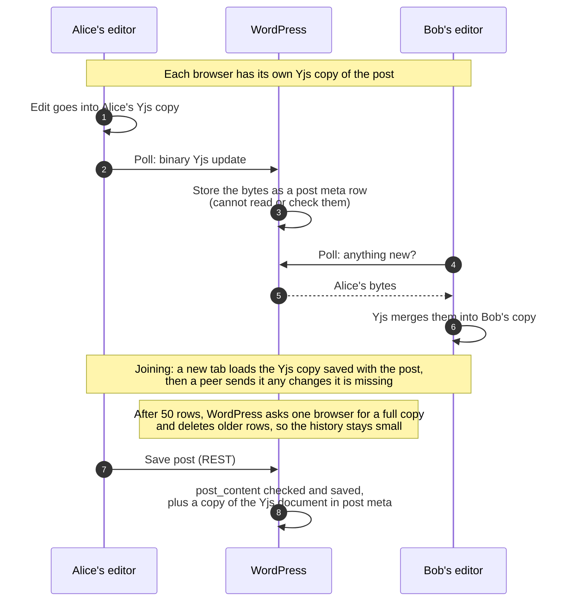
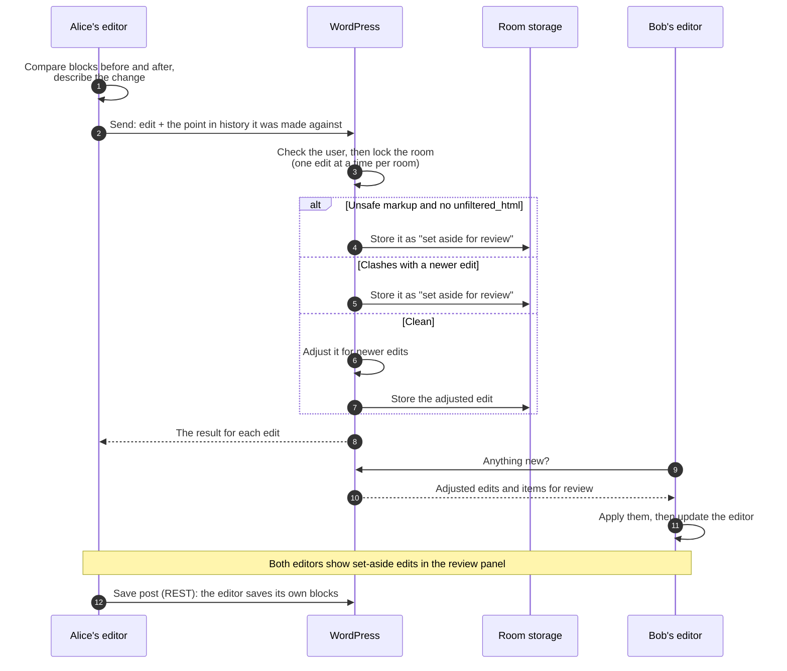
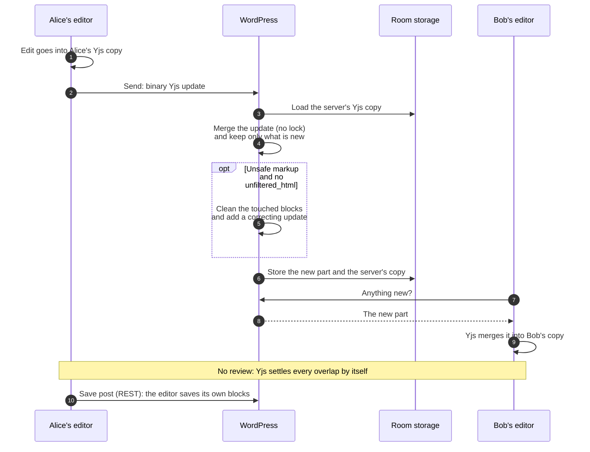
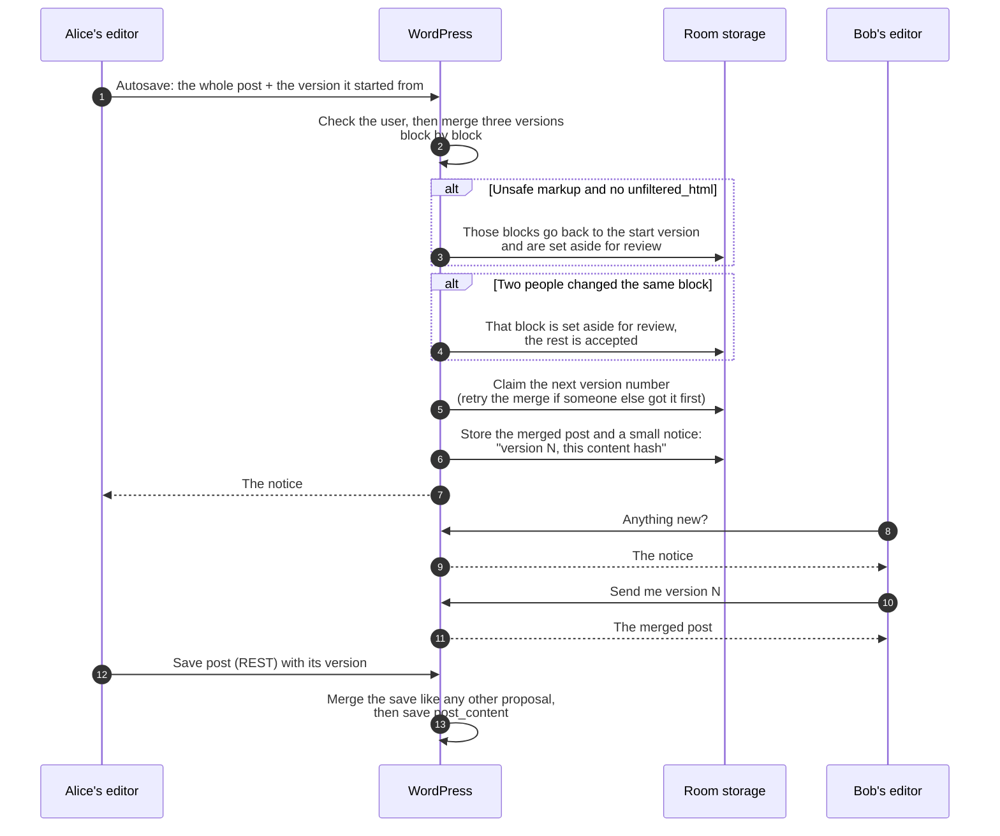
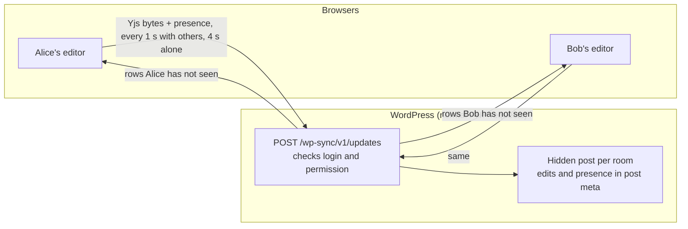
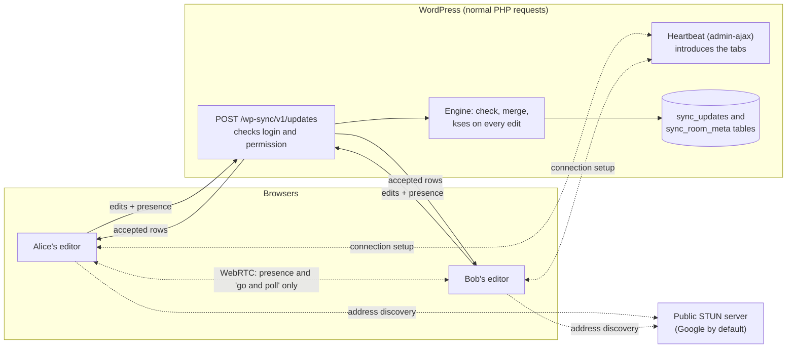
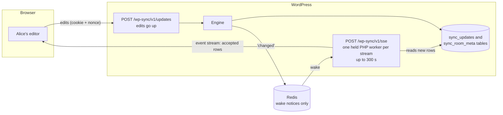
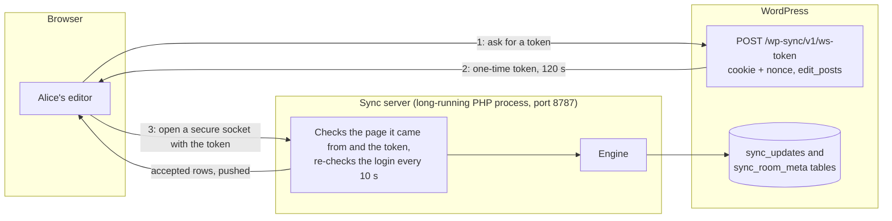

# Data flow

This page shows how one person's edit reaches everyone else editing the
same post. It covers today's Gutenberg trunk experiment and what this
plugin proposes instead. There are two views:

- **[The block editor view](#the-block-editor-view)**: who merges edits,
  what the server can check, and what happens to conflicts. One chart per
  merge method (we call these "engines").
- **[The network and security view](#the-network-and-security-view)**:
  which connections carry what, who checks credentials, and what an
  operator has to run. One chart per delivery method (we call these
  "transports").

## The short version

In the Gutenberg trunk experiment, **every browser merges edits and
WordPress only passes them along**. WordPress stores the edits as bytes
it cannot read. It cannot check them, sanitize them, or notice that two
people changed the same thing. It sees the content only when someone
saves the post.

This plugin proposes that **WordPress takes part in every edit**. The
server receives each edit, checks who sent it and what it contains,
merges it, and stores the result. Other browsers then receive what the
server accepted. All three engines work this way, and they differ only
in how the merge works. The engine choice and the transport choice are
separate: any engine runs over any transport.

| | Trunk experiment | This plugin |
| --- | --- | --- |
| Who merges | Every browser | WordPress (yjs-server: WordPress and every browser) |
| What WordPress can read | Nothing until the post is saved | Every edit as it arrives |
| Markup safety checks (kses) on live edits | None | Every edit, at the server (each engine responds differently; see below) |
| Same-spot conflicts | Settled silently | Set aside for review (intent-log, de-rtc) or settled silently (yjs-server) |
| How edits travel | Short polling only | Short polling, server-sent events, or WebSocket |
| Where edits are stored | Post meta on a hidden post per room | Two plugin tables |
| Without the feature | Post lock | Post lock |

A **room** is one shared document, usually one post. A **row** is one
stored entry in a room's history. Every browser remembers the last row
it has seen, and asks for the rows after it.

## The block editor view

### Trunk experiment: browsers merge, WordPress relays

Each browser keeps its own copy of the post as a Yjs document. Yjs is a
library that merges concurrent edits automatically: every copy that
receives the same changes ends up the same. Browsers send Yjs updates
(binary data) to WordPress. WordPress stores them and hands them to the
other browsers, which merge them.

What this means:

- The server is a relay. It cannot reject unsafe markup, enforce
  per-block rules, or tell a real conflict from a clean merge.
- Content is checked only when someone saves the post. Until then, a
  user who can edit the post can push any block content into the other
  editors.
- Two people changing the same thing at once do not see a conflict.
  Yjs keeps both pieces of typed text, or picks one value for a
  setting, with no warning.

### intent-log (default): WordPress transforms typed edits

The browser turns each change into a small, readable description, such
as "insert 'x' at position 4 in paragraph p1". Each description records
which point in the history it was made against. WordPress puts edits in
order one room at a time, adjusts each one for anything newer, and
stores the result. If it cannot adjust an edit safely, it sets it aside
for a person to review.

### yjs-server: one Yjs copy on the server too

The browser side is the same as the trunk experiment: each browser has a
Yjs copy and sends Yjs updates. The difference is that WordPress keeps
its own Yjs copy of each room and merges every update into it. Because
the server can read the merged result, it can check content. It stores
only the part of each update that was new.

### de-rtc: whole-document proposals, three-way merge

This engine ports the Distributed Editing design, a save-based merging
proposal for WordPress core. The browser sends
the whole post, plus the version it started from, at most once every
10 seconds (a setting). For posts and pages this goes through the
ordinary autosave endpoint. WordPress compares three versions (the
starting version, the newest version, and the proposal), merges them
block by block, and announces the new version number. Other browsers
then download the new content once.

### What the engines do with the same situation

| | Trunk experiment | intent-log | yjs-server | de-rtc |
| --- | --- | --- | --- | --- |
| What a browser sends | Yjs updates | Small typed edits | Yjs updates | The whole post, at most every 10 s |
| Who merges | Browsers | WordPress | WordPress and browsers | WordPress |
| Two people change the same spot | One wins silently | Set aside for review | One wins silently | Set aside for review |
| Unsafe markup from a user without `unfiltered_html` | Reaches peers, checked on save | Set aside for approval | Cleaned by the server | Reverted and set aside |
| Server cost per edit | Store and forward | Lock, adjust, store | Highest: decode, merge, and re-encode the room's Yjs copy | Merge the whole post |
| Who writes `post_content` | The editor's save | The editor's save | The editor's save | The editor's save, merged first |

In every engine, a new room starts from the saved `post_content`.

## The network and security view

All four setups below use the same logged-in WordPress session. Every
request carries the user's login cookie and a REST nonce (a short-lived
code that proves the request came from the user's own page). The one
exception is the WebSocket connection, which uses a short-lived token
(described below). Every setup checks permissions the same way: the
user needs `edit_posts`, and for each room the matching per-object
capability (`edit_post`, `edit_term`, or `edit_comment`).

### Trunk experiment: short polling

- **Connections:** ordinary HTTPS requests to the WordPress REST API. No
  extra service.
- **What the server checks:** the user and their permission for the
  room. It does not look inside the edits.
- **Limits:** 16 MB per request, 1 MB per update, 50 rooms per request.
- **People per room:** the limit of 3 is enforced only in the browser,
  so a modified browser can go past it. The server does not stop it.

### Short polling (this plugin's default)

The same kind of request as trunk, but the server runs the engine on
every edit. Beside it, each tab opens an **advisory channel**: a side
channel that carries only "who is here" and "something changed, go and
poll". It never carries content. When every tab in a room can hear
each other, they poll only when told to, so an idle room makes almost
no requests.

- **Connections:** HTTPS to WordPress, plus a direct browser-to-browser
  WebRTC link between the people in a room (up to 8 per tab). The link
  is set up through the WordPress heartbeat. To find a route, browsers
  ask a public address-finding (STUN) server: Google's by default, and
  the `gutenberg_sync_engines_advisory_ice_servers` filter changes it.
  No server that relays traffic when a direct link fails (TURN) is
  configured, so some pairs cannot connect, for example two people
  behind strict office firewalls. Those tabs keep polling on a timer.
- **Exposure:** peers on a direct link can see each other's network
  addresses, and the STUN server sees every client. A site that cannot
  accept this can use the WebSocket advisory link instead (one socket
  per tab to the WebSocket server or to the host's own relay), or turn
  the channel off.
- **What a misbehaving peer can do:** only someone who can already edit
  the post gets onto the channel. The worst they can do is cause extra
  polls (at most one every 250 ms) or show false presence. They cannot
  change content, because content only comes from WordPress.
- **Polling interval:** 5 seconds by default (a setting).

### Server-sent events (SSE)

Each visible tab with collaborators keeps one stream open to receive
changes. Edits still go up as normal requests. The stream wakes when a
room changes, either through Redis notices or by checking a change
counter every half second.

- **Connections:** HTTPS to WordPress only. Redis is optional, and when
  it is used it is a server-side connection (`redis://`, `rediss://`,
  or a socket, with a password if set).
- **What Redis holds:** only the word "changed", on a channel named by a
  hash of the site and room. No content. If Redis fails, streams fall
  back to checking the counter.
- **Operator cost:** each open stream holds one PHP worker. Hidden tabs
  and tabs where the person is alone close their stream.
- **Proxies:** must not buffer or compress the stream, and must allow
  long responses. If a stream cannot open, the tab falls back to
  polling and retries later.
- **Permissions:** the stream checks rooms again each time it wakes. The
  login session is checked again only when the stream reconnects.

### WebSocket

A long-running PHP process (`wp collaboration sync-server`) holds one
socket per tab. It runs the same engine code as the REST route and
writes to the same tables, then pushes accepted rows to everyone in the
room.

- **Connections:** HTTPS for the token, then one socket per tab to the
  sync server. The server speaks plain `ws://`, so a proxy in front of
  it must provide TLS (`wss://`). Its port must be reachable from
  browsers.
- **Credentials, default mode:** the login cookie plus a one-time token
  (random, 120 seconds, deleted on use). The token's user must match
  the cookie's user.
- **Credentials, access-token mode:** when a secret is configured, the
  token route issues a signed token that lasts two minutes instead. A host
  can then run its own relay that checks the token with the secret
  alone, without access to WordPress.
- **Limits:** 512 connections in total, 20 per IP address, 200 messages
  per 5 seconds per connection. A tab cannot switch its client id
  inside a room.
- **Failure:** if the socket drops, its rooms fall back to polling and
  move back when the socket returns, from the same point.

### Transports side by side

| | Trunk short polling | Short polling | SSE | WebSocket |
| --- | --- | --- | --- | --- |
| New services to run | None | None to operate; a public STUN server is contacted by default | None, Redis optional | The sync server process, behind TLS |
| Credentials | Cookie + nonce | Cookie + nonce | Cookie + nonce | One-time token + cookie, or a signed token |
| Content inspected by the server | No | Yes, every edit | Yes, every edit | Yes, every edit |
| Where content is stored | Post meta | Plugin tables | Plugin tables | Plugin tables |
| What runs between requests | Nothing | Nothing (peers talk directly) | One PHP worker per open stream | One long-running process |
| Typical delay | 1 s | On demand when peers can hear each other, else 5 s | Under a second | Under a second |
| If it fails | Retry, then a disconnect notice | Timer polling | Falls back to polling | Falls back to polling |
