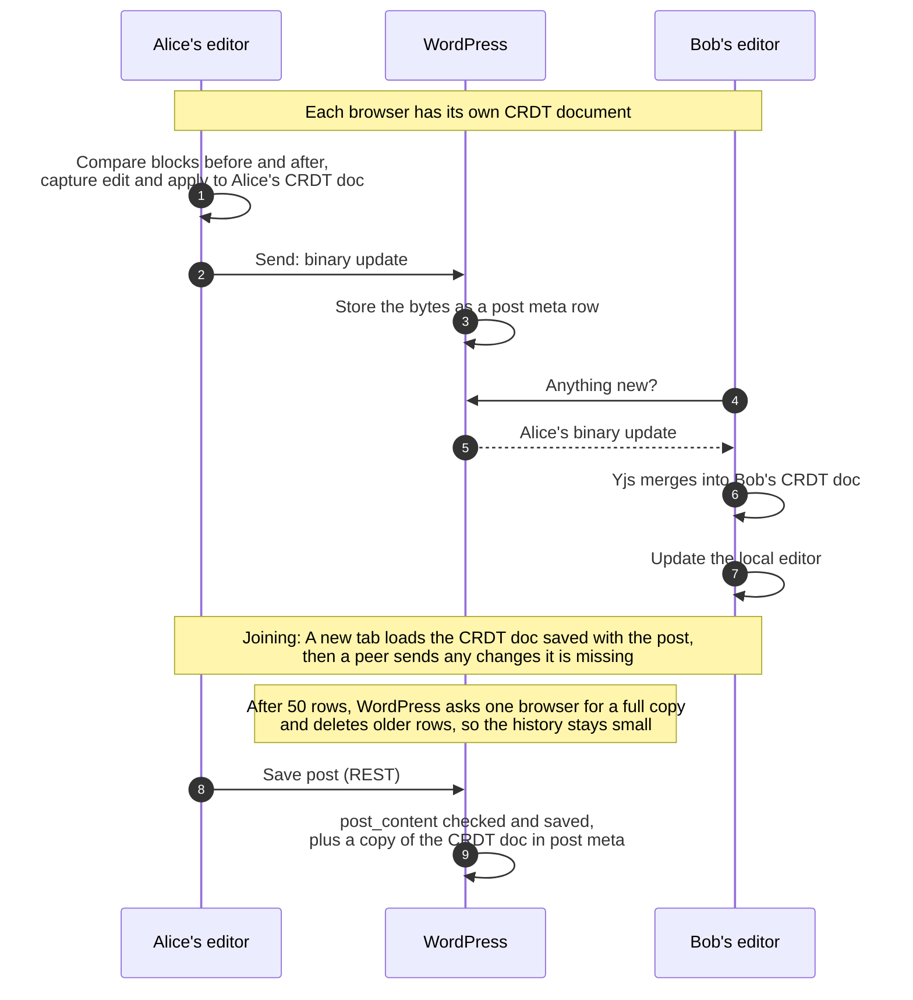
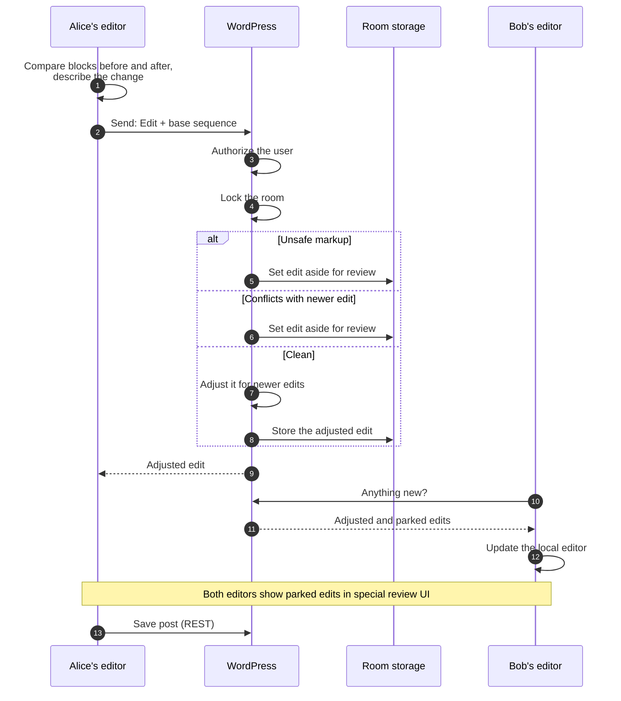

# Data flow

This page shows how one person's update reaches everyone else during
collaborative editing. It covers today's Gutenberg experiment
(including the WPVIP WebSocket transport, which can stand in for its
polling) and what this plugin proposes.

## Short version

In the Gutenberg experiment, **browsers merge updates and WordPress
is just a relay**. WordPress stores the updates as bytes, but cannot
read them, validate them, sanitize them, or notice that two people
changed the same thing. It is only aware of how the content has changed
when someone saves the post.

This plugin proposes that **WordPress takes part in every update**. The
server receives each edit, checks who sent it and what it contains,
merges it, and stores the result. Other browsers then receive what the
server accepted. All three engines work this way, and they differ only
in how the merge works. The engine choice and the transport choice are
separate: any engine runs over any transport.

|                                             | Gutenberg experiment                | This plugin                                                                |
| ------------------------------------------- | ----------------------------------- | -------------------------------------------------------------------------- |
| Who merges                                  | Browsers                            | WordPress (yjs-server: also browsers)                                      |
| What WordPress can read                     | Nothing until the post is saved     | Every edit as it arrives                                                   |
| Markup safety checks (`kses`) on live edits | None                                | Every edit as it arrives                                                   |
| Same-spot conflicts                         | Settled silently                    | Set aside for review (intent-log, de-rtc) or settled silently (yjs-server) |
| How edits travel                            | Short polling, or WPVIP's WebSocket | Short polling, server-sent events (web tier or daemon), or WebSocket       |
| Where edits are stored                      | Post meta on a custom post type     | Two custom tables                                                          |

A **room** is one shared document, usually a post. A **row** is one
stored entry in a room's history. Every browser remembers the last row
it has seen, and asks for the rows after it.

## Block editor data flow

### Gutenberg experiment

Each browser keeps its own copy of the post as a CRDT (Yjs) document.
Browsers send Yjs updates (binary data) to WordPress. WordPress stores
them and relays them to the other browsers, which merge them into their
copy.

If you'd like a more detailed breakdown of the data flow, see the
[step-by-step](#one-keystroke-step-by-step) section below.

What this means:

-   The server is a relay. It cannot reject unsafe markup, enforce
    per-block rules, or tell a real conflict from a clean merge.
-   Content is checked only when someone saves the post. Until then, a
    user who can edit the post can push any block content into the other
    editors.
-   Two people changing the same thing at once do not see a conflict. Yjs
    merges the changes silently. For single values, one edit wins (chosen
    by client ID, not by time). For text, both people's typing is kept.

**The WPVIP WebSocket transport** works the same way: a separate
Node.js server relays Yjs updates between browsers and stores nothing,
so WordPress still sees the content only when the post is saved.

### This plugin, intent-log engine

The browser turns each change into a small, readable description, such
as "insert 'x' at position 4 in paragraph 2". Each description records
which point in the history it was made against (base sequence).
WordPress handles one edit at a time for each post. If newer edits
exist, it adjusts the edit so that it merges cleanly. If it cannot
adjust an edit safely, it sets it aside for a human to review.

### This plugin, yjs-server engine

The browser side is the same as the Gutenberg experiment: each browser
maintains a CRDT document and sends binary Yjs updates. The difference
is that WordPress has a full Yjs library, holds its own main CRDT
document, and merges every update into it. Because the server can read
the merged result, it can check content.

### This plugin, de-rtc engine

A save-based merging engine where the browser sends the whole post, plus
its base version, through the ordinary autosave endpoint. WordPress
compares three versions: the base version, the newest version (if it
exists), and the proposed version. It merges them block by block and
announces the new version number. Other browsers then fetch and apply
the new version.

## Transports

A transport is how updates travel; any engine runs over any transport.
Short polling is the base: the editor asks WordPress for new rows on a
timer, and a side channel between the tabs on one post (the advisory
channel) tells a tab when to ask, so an idle room makes almost no
requests. Server-sent events and the sync daemon's WebSocket push rows
instead. The table of what each costs and needs is in
[transports.md](transports.md).

## One keystroke, step by step

The first and last steps are the same for the Gutenberg experiment and
for every engine here.

1. The user types. Rich text updates the block's `content` attribute,
   `useBlockSync` passes the new block tree to core-data, and
   `editEntityRecord` hands the edit to the sync manager right before
   it stores it. (This ordering is the trap in
   the Traps section of `AGENTS.md`: a push made from inside that call is
   overwritten.)
2. The engine records the edit. The experiment and yjs-server write it
   into the Yjs document and queue the binary update. Intent-log
   compares the editor's blocks with the version they show, turns the
   difference into typed edits, and applies them locally. De-rtc marks
   its plain record as changed.
3. The edit travels. The experiment, intent-log and yjs-server send
   the queue on the next poll. The queue is kept in the browser while
   the tab is alone and sent when another person joins, on save, or
   when the tab is hidden. De-rtc instead builds a proposal (the whole
   post plus the version it started from) at most every ten seconds.
   Posts and pages send it to the autosave endpoint, then tell peers to
   poll.
4. A peer receives. Yjs engines merge the update into their document.
   Intent-log adds the rows to its local history and recomputes its
   own pending edits on top, then pushes the merged block list once
   typing pauses. De-rtc receives a short notice of the new version,
   fetches it, and merges it into its record once typing pauses,
   keeping its own unsent edits.
5. The merged blocks reach the editor as a local `EDIT_ENTITY_RECORD`
   that skips the sync manager, so it is not sent back and stays out of
   the peer's undo history. `useBlockSync` replaces the blocks and rich
   text updates the page.
