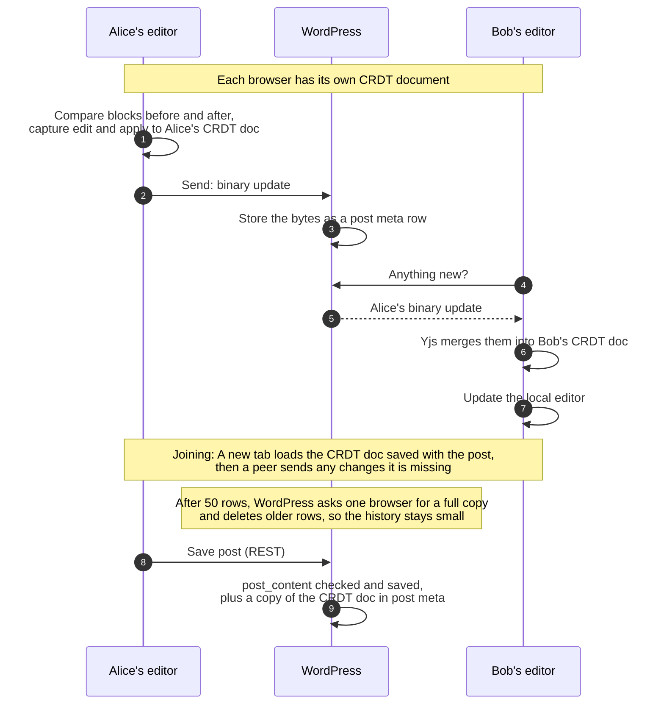
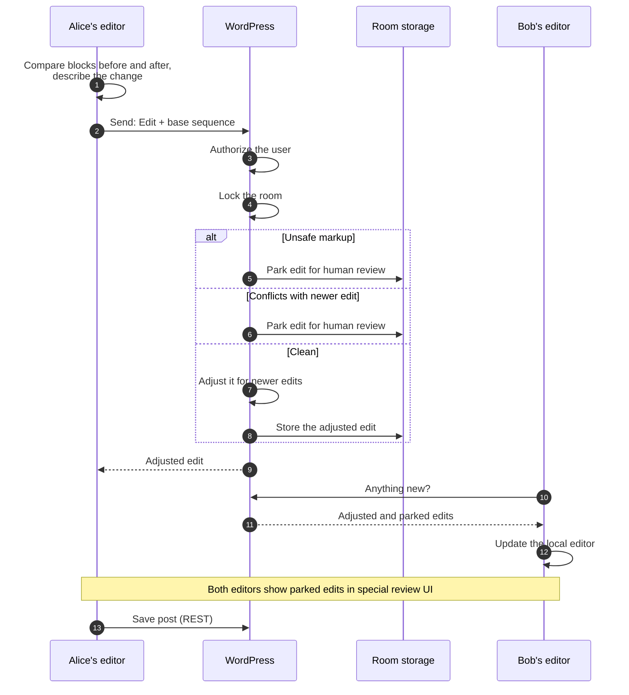
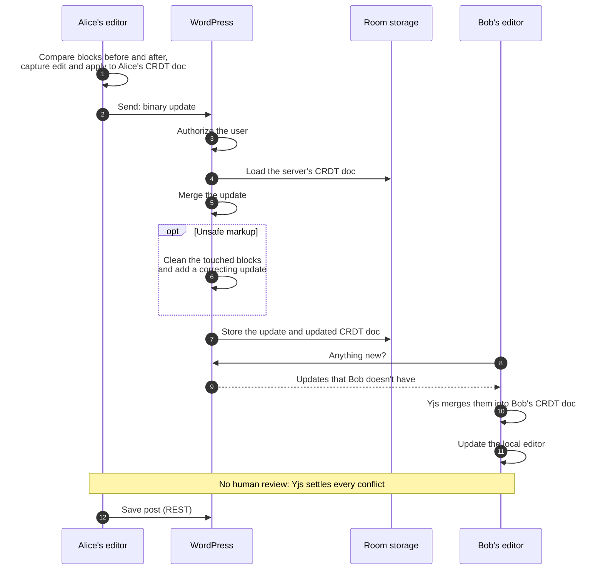
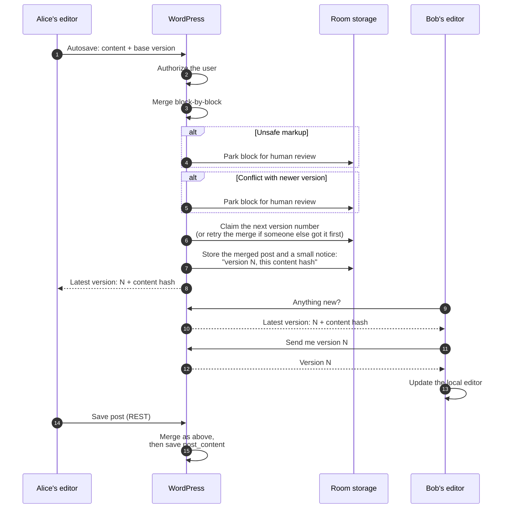

# Data flow

This page shows how one person's update reaches everyone else during collaborative editing. It covers today's Gutenberg `trunk` experiment, the WPVIP WebSocket transport, and what this plugin proposes.

## The short version

In the Gutenberg RTC experiment, **browsers merge updates and
WordPress is just a relay**. WordPress stores the updates as bytes, but cannot read them, validate them, sanitize them, or notice that two
people changed the same thing. It sees the updates only when someone
saves the post.

This plugin proposes that **WordPress takes part in every update**. The
server receives each edit, checks who sent it and what it contains,
merges it, and stores the result. Other browsers then receive what the
server accepted. All three engines work this way, and they differ only
in how the merge works. The engine choice and the transport choice are
separate: any engine runs over any transport.

|                                             | Experiment                      | This plugin                                                                |
| ------------------------------------------- | ------------------------------- | -------------------------------------------------------------------------- |
| Who merges                                  | Browsers                        | WordPress (yjs-server: also browsers)                                      |
| What WordPress can read                     | Nothing until the post is saved | Every edit as it arrives                                                   |
| Markup safety checks (`kses`) on live edits | None                            | Every edit as it arrives                                                   |
| Same-spot conflicts                         | Settled silently                | Set aside for review (intent-log, de-rtc) or settled silently (yjs-server) |
| How edits travel                            | Short polling or WebSocket      | Short polling, server-sent events, or WebSocket                            |
| Where edits are stored                      | Post meta on a custom post type | Two custom tables                                                          |

A **room** is one shared document, usually one post. A **row** is one
stored entry in a room's history. Every browser remembers the last row
it has seen, and asks for the rows after it.

## The block editor view

### Gutenberg experiment

Each browser keeps its own copy of the post as a CRDT (Yjs) document. Browsers send Yjs updates (binary data) to WordPress. WordPress stores them and relays them to the other browsers, which merge them into their copy.

What this means:

-   The server is a relay. It cannot reject unsafe markup, enforce
    per-block rules, or tell a real conflict from a clean merge.
-   Content is checked only when someone saves the post. Until then, a
    user who can edit the post can push any block content into the other
    editors.
-   Two people changing the same thing at once do not see a conflict. Yjs
    merges the changes silently. For single values, one edit wins (chosen
    by client ID, not by time). For text, both people's typing is kept.

### This plugin, intent-log engine

The browser turns each change into a small, readable description, such
as "insert 'x' at position 4 in paragraph 2". Each description records
which point in the history it was made against (base sequence). WordPress puts edits in order one room at a time. If there are newer updates, it attempts to adjust the update so that it can be cleanly merged. If it cannot adjust an edit safely, it sets it aside
for a human to review.

### This plugin, yjs-server engine

The browser side is the same as the Gutenberg experiment: each browser maintains a
CRDT document and sends binary Yjs updates. The difference is that WordPress has a full Yjs library, holds its own canonical CRDT document, and merges every update into it. Because
the server can read the merged result, it can check content.

### This plugin, de-rtc engine

A save-based merging engine where the browser sends
the whole post, plus its base version, through the ordinary autosave endpoint. WordPress compares three versions: the
base version, the newest version (if it exists), and the proposed version. It merges them
block by block and announces the new version number. Other browsers
then fetch and apply the new version.

### What the engines do with the same situation

|                                                     | Experiment                | intent-log             | yjs-server                            | de-rtc                          |
| --------------------------------------------------- | ------------------------- | ---------------------- | ------------------------------------- | ------------------------------- |
| What a browser sends                                | Yjs updates               | Small typed edits      | Yjs updates                           | The whole post, on timer        |
| Who merges                                          | Browsers                  | WordPress              | WordPress and browsers                | WordPress                       |
| Two people change the same spot                     | One wins silently         | Set aside for review   | One wins silently                     | Set aside for review            |
| Unsafe markup from a user without `unfiltered_html` | Reaches peers, vulnerable | Set aside for approval | Cleaned by the server                 | Set aside for approval          |
| Server cost per edit                                | Store and forward         | Lock, adjust, store    | Decode, merge, and re-encode CRDT doc | Merge the whole post            |
| Who writes `post_content`                           | The editor's save         | The editor's save      | The editor's save                     | The editor's save, merged first |
| New room starts from                                | Saved entity              | Saved entity           | Saved entity                          | Saved entity                    |

## Transports

A transport is how updates travel between the server and peers. This plugin provides multiple transport options.

|                     | Experiment short-polling                     | Short-polling                        | SSE                           | WebSocket                                  |
| ------------------- | -------------------------------------------- | ------------------------------------ | ----------------------------- | ------------------------------------------ |
| Advisory transport  | No                                           | WebRTC or WebSocket                  | Ignored                       | Ignored                                    |
| New services to run | None                                         | None                                 | None, Redis optional          | Separate PHP daemon                        |
| Credentials         | Cookie + nonce                               | Cookie + nonce                       | Cookie + nonce                | One-time token + cookie, or a signed token |
| Long-lived process  | No                                           | No                                   | One PHP worker per connection | One long-running process                   |
| Typical latency     | 1 s                                          | <1 s with advisory channel, else 5 s | <1 s                          | <1 s                                       |
| If it fails         | Retry with backoff, then a disconnect notice | Retry with backoff                   | Falls back to polling         | Falls back to polling                      |
